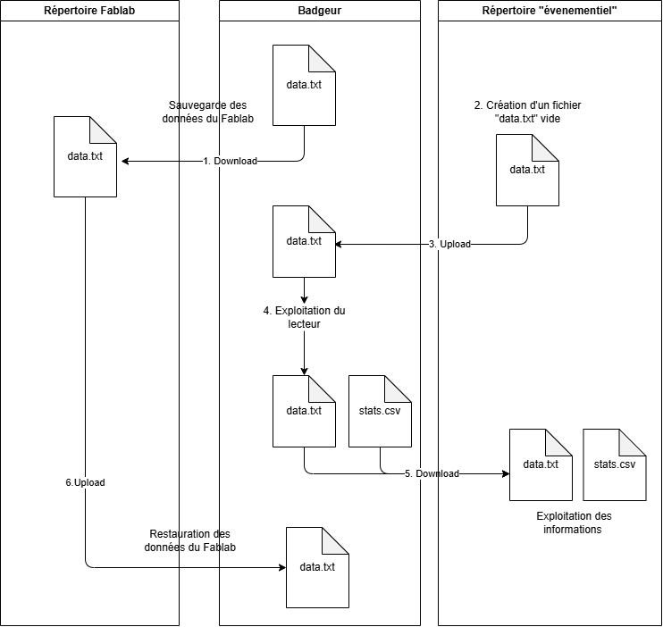

# Permutation de l'usage du lecteur de badge

Bien que le lecteur de badge ait été conçu pour mesurer la fréquentation d'un lieu unique, il est possible de permuter ponctuellement son utilisation pour des evenements spécifiques.

## Principe de fonctionnement

Le lecteur de badge met à jour à chaque évènement les informations de fréquentation dans deux fichiers internes :
- Fichier `data.txt` : Le lecteur de badge enregistre dans un fichier, à chaque badgeage, le numéro de badge et la date/heure de l'évènement.
- Fichier `stats.csv` : les données d'évènement sont exploitées pour en déduire le nombre de visites et de visiteurs uniques par période mensuelle

Il est possible de télécharger ces deux fichiers depuis l'interface web de l'appareil.  
L'interface web permet également d'uploader un fichier `data.txt` sur l'appareil, et d'écraser le fichier interne existant.

## Accès à l'interface web

1. Appuyer sur le bouton situé sur le coté de l'appareil.
2. Cela active un "hotspot" wifi ainsi qu'un serveur web.
3. Pour y accéder : 
    - noter les informations (nom du réseau wifi, password, adresse ip du serveur) qui s'affichent sur l'écran du lecteur de badge
    - sur un téléphone, ou un PC sans VPN tel que ceux du fablab, connectez-vous au réseau wifi du lecteur
    - ouvrez un navigateur web et saisissez l'adresse ip précisée en tant qu'adresse web (par exemple `192.168.4.1`)
    - le navigateur affiche les statistiques de fréquentation 
    - un lien vous permet d'accéder aux fonctions d'administration, y compris les fonctions de download et d'upload
4. Le service web se désactive après un nouvel appui sur le bouton, ou au bout de 10 minutes

## Procédure de permutation

1. Sauvergarde des données du Fablab : télécharger le fichier `data.txt` et le sauvegarder dans un répertoire dédié au Fablab
2. Mise à zéro des statistiques : créer un fichier `data.txt` vide et l'uploader sur le serveur web
3. Exploitation du lecteur pour le nouvel usage...
4. Exploitation des données : depuis le serveur web, downloader les fichiers `data.txt` et `stats.csv` dans un répertoire dédié à l'évenement
5. Restauration des données Fablab : sur le serveur web, uploader le fichier `data.txt` sauvergardé depuis l'étape 1.

